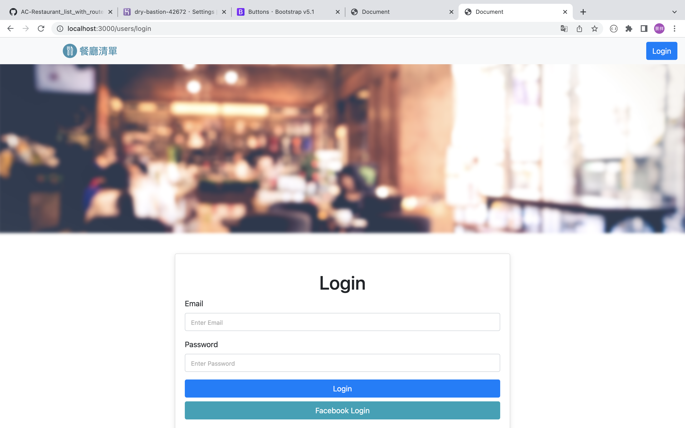

# 餐廳清單


## 介紹
使用者必須先註冊登入後才能使用餐廳清單，此清單可以打造專屬於你的餐廳明細！
### 功能

基本功能：

- 使用者可以使用Facebook帳號登入
- 使用者可以新增一家餐廳
- 使用者可以瀏覽一家餐廳的詳細資訊
- 使用者可以瀏覽全部所有餐廳
- 使用者可以修改一家餐廳的資訊
- 使用者可以刪除一家餐廳

- 使用者可以透過搜尋餐廳名稱及美食種類來找到特定的餐廳

## 開始使用

1. 請先確認有安裝 node.js 與 npm
2. 將專案 clone 到本地
3. 在本地開啟之後，透過終端機進入資料夾，輸入：

   ```bash
   npm install
   ```
4.下載完成後新增一個.env，放入 MONGODB_URI，連結你的 mongoDB

   ```bash
   MONGODB_URI="<根據自己的MONGODB_URI及帳號密碼做設定>"
   ```

5.使用以下方法使種子資料初始化
   ```bash
   npm run seed
   ```
   ```bash
   node models/seeds/restaurantSeeder.js
   ```

6. 安裝及設置完畢後，繼續輸入：

   ```bash
   npm run start
   ```

7. 若看見此行訊息則代表順利運行，打開瀏覽器進入到以下網址

   ```bash
   Listening on http://localhost:3000
   ```

8. 暫停使用

   ```bash
   ctrl + c
   ```
## 開發工具

- Node.js 14.16.0
- Express 4.16.4
- Express-Handlebars 3.0.0

- Bootstrap 4.3.1
- Font-awesome 5.8.1

- MongoDB
- mongoose 6.3.3
- bcryptjs 2.4.3
- body-parser 1.20.0
- connect-flash 0.1.1
- dotenv 8.2.0    
- express-session 1.17.1
- method-override 3.0.0

- passport 0.4.1
- passport-facebook 3.0.0
- passport-local 1.0.0
